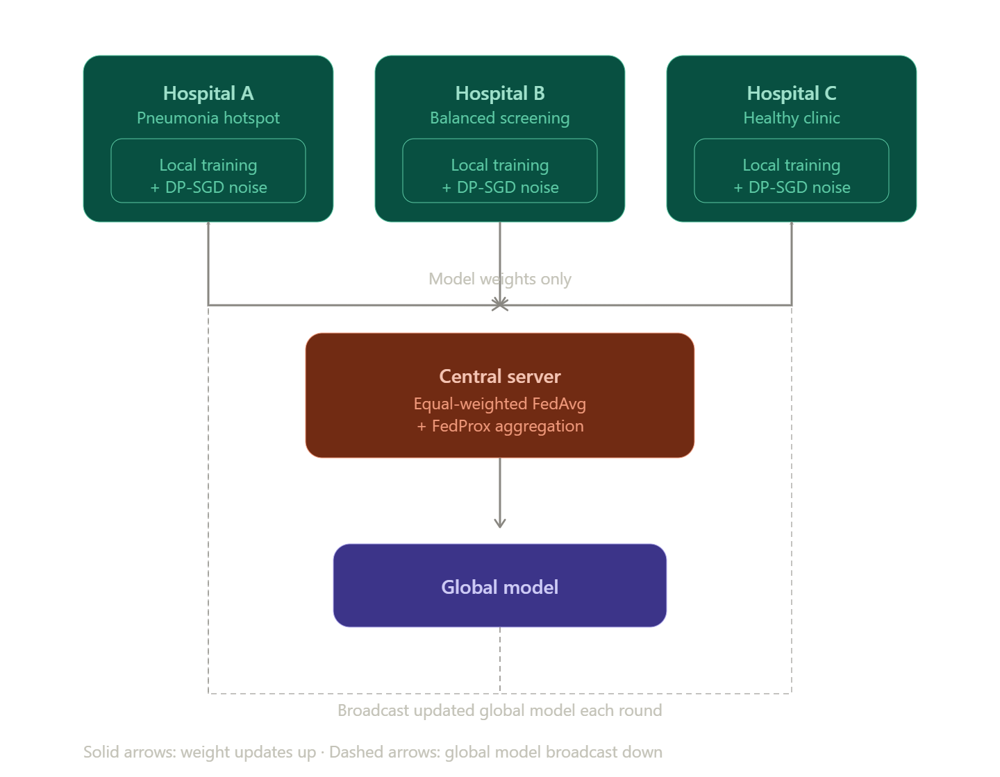

# Privacy-Preserving Federated Learning for Pneumonia Detection

A federated learning pipeline that trains a convolutional neural network to detect
pneumonia from chest X-rays across three simulated hospital nodes, using
Differential Privacy to protect individual patient records — without any hospital
ever sharing raw image data.

Built with **Flower** (federated orchestration), **Opacus** (differential privacy /
DP-SGD), and **PyTorch**, trained and evaluated on the **PneumoniaMNIST** dataset
(28×28 grayscale chest X-rays).

---

## Project Overview

Real hospitals cannot pool patient X-rays into a single shared dataset due to
privacy regulation (HIPAA/GDPR). Federated Learning solves this by training a
shared global model without centralizing data: each hospital trains locally, and
only model weight updates — never raw images — are sent to a central server for
aggregation.

This project goes further by adding **Differential Privacy** (via Opacus) to each
hospital's local training, protecting against reconstruction of individual patient
images from intercepted model weights, and simulates a **realistic, non-IID**
hospital network rather than an artificially balanced one.

---

## Architecture



### Components

| File | Role |
|---|---|
| `data_setup.py` | Splits data into 3 non-IID hospital partitions with realistic label skew; oversamples each hospital's local minority class |
| `model.py` | `SimpleMedicalCNN` — a compact CNN using GroupNorm (Opacus-compatible; BatchNorm is not supported under per-sample DP) |
| `client.py` | Flower client: local training with DP-SGD (Opacus) + FedProx regularization |
| `server.py` | Flower server: equal-weighted FedAvg aggregation strategy |
| `run_all.py` | Launches the server and all 3 hospital clients as subprocesses |
| `train_baseline.py` | Trains a non-federated, non-private control model for comparison |
| `evaluate_test_set.py` | Evaluates a saved model against a held-out, untouched test set; reports sensitivity/specificity across decision thresholds |

---

## Key Design Decisions

**Non-IID data partitioning.** Rather than randomly splitting data (which creates
an artificially easy IID setting), each hospital receives a distinct, realistic
label distribution:
- **Hospital A (Pneumonia Hotspot):** 80% of all pneumonia cases, 10% of normal cases
- **Hospital B (Community Screening):** a balanced middle distribution
- **Hospital C (Healthy Clinic):** 80% of all normal cases, remaining pneumonia cases

**GroupNorm instead of BatchNorm.** Opacus requires per-sample gradients, which
BatchNorm's cross-sample statistics are incompatible with. GroupNorm normalizes
within each individual sample and is the standard substitution.

**Oversampling instead of loss weighting for class imbalance.** This was a
significant finding during development (see *Debugging Journey* below):
class-weighted loss functions are silently neutered by Opacus's per-sample
gradient clipping, since clipping caps every sample's gradient magnitude
equally regardless of its assigned loss weight. Oversampling the minority class
changes *how often* an example is seen rather than *how large* its gradient is,
so it survives clipping intact.

**FedProx instead of plain FedAvg.** Under severe non-IID skew, local models
drift significantly from the global model between aggregation rounds. FedProx
adds a proximal term that penalizes local weights from drifting too far from the
last global checkpoint. Since this term is a function of model weights rather
than individual training examples, it is computed analytically and added
directly to gradients *after* Opacus's per-sample clipping step — combining it
naively via a single `.backward()` call would bypass Opacus's per-sample
tracking and produce an unreliable privacy accounting.

**Equal-weighted aggregation instead of sample-count-weighted FedAvg.** Standard
FedAvg weights each client's contribution by its local dataset size. Given the
intentional size imbalance across hospitals (Hospital A has far more data than
Hospital C), this caused the global model to be dominated by Hospital A,
collapsing to a majority-class classifier. Aggregation now averages all
hospitals' updates equally regardless of size.

---

## Results

Evaluated on a held-out, untouched test set (not seen during any hospital's
local training), at decision threshold 0.5.

| Configuration | Privacy (ε) | Accuracy | Sensitivity | Specificity |
|---|---|---|---|---|
| Centralized baseline (oversampled, no privacy, no federation) | N/A | 80.29% | 98.72% | 49.57% |
| **Federated + DP + FedProx (this system)** | **≤ 5.59** | **85.90%** | **93.85%** | **72.65%** |

*The centralized baseline uses the same oversampling as the federated system, so
this comparison isolates the effect of federation + differential privacy +
FedProx specifically, rather than conflating it with the imbalance-handling
technique.*

*Privacy budget (ε) is reported as the worst-case value across all three
hospitals (each hospital has a different local dataset size, and therefore a
different sampling rate feeding into the privacy accountant). δ = 1e-5.*

**Reading these results:** the federated, private system achieves higher overall
accuracy and substantially higher specificity than the non-private centralized
baseline, at some cost to sensitivity (93.85% vs. 98.72%). Sensitivity above 90%
is generally considered acceptable for a screening tool, though this tradeoff
should be tuned based on the specific clinical deployment context — see
*Threshold Tuning* below.

### Threshold tuning

`evaluate_test_set.py` sweeps multiple decision thresholds, allowing sensitivity
and specificity to be traded off without retraining:

| Threshold | Accuracy | Sensitivity | Specificity |
|---|---|---|---|
| 0.5 | 85.90% | 93.85% | 72.65% |
| 0.6 | 86.06% | 93.08% | 74.36% |
| 0.7 | 85.74% | 91.79% | 75.64% |
| 0.8 | 84.29% | 88.97% | 76.50% |
| 0.9 | 83.81% | 87.44% | 77.78% |

---

## Threat Model

**What this system defends against:** membership inference and data
reconstruction attacks targeting individual patient X-rays, via record-level
differential privacy (DP-SGD). Even if a global model checkpoint were
compromised, no single training image can be reliably reconstructed or
confirmed as part of the training set, within the stated privacy budget (ε ≤ 5.59).

**What this system does *not* defend against:** a compromised or curious central
aggregation server. The server receives each hospital's individually
DP-protected weight update before averaging; it does not use Secure Aggregation,
so a malicious server could in principle observe patterns in an individual
hospital's updates over time. Pairing DP with Secure Aggregation or Functional
Encryption to ensure the server only ever sees the combined sum of updates is
identified as future work.

---

## Debugging Journey

This project surfaced several non-obvious failure modes worth documenting:

1. **Initial mode collapse.** Under severe non-IID skew combined with
   sample-count-weighted FedAvg, the global model collapsed to always predicting
   "pneumonia" (majority class), driven by Hospital A's large data volume
   dominating aggregation. Fixed by switching to equal-weighted aggregation.

2. **Class-weighted loss silently neutralized under DP.** After fixing
   aggregation, per-hospital class weighting was added to correct local
   imbalance — but had no effect. Diagnosis: Opacus's per-sample gradient
   clipping caps every sample's gradient magnitude uniformly, which cancels out
   the effect of loss weighting before it can influence training. Fixed by
   switching to oversampling of the minority class, which changes sampling
   frequency rather than gradient magnitude, and survives clipping.

3. **Privacy budget explosion.** An early configuration (`noise_multiplier=0.10`,
   5 local epochs, 21+ rounds) produced a cumulative epsilon in the tens of
   thousands — a meaningless privacy guarantee. Root cause: too many total
   training steps relative to a noise multiplier that was far too weak.
   Corrected to `noise_multiplier=1.0`, `local_epochs=1`, `num_rounds=10`,
   yielding an honest epsilon in the single digits (1.71–5.59).

---

## Known Limitations

- **Image resolution.** PneumoniaMNIST images are 28×28 pixels — a proof-of-concept
  resolution, not representative of clinical-grade diagnostic imaging.
- **Simulated, not real, hospitals.** All partitions are drawn from a single
  public dataset; real-world deployment would need to validate against genuine
  multi-institutional data with scanner- and population-level variation beyond
  label skew alone.
- **No Secure Aggregation.** See *Threat Model* above.
- **Small client count.** Only 3 simulated hospitals; FedAvg/FedProx dynamics at
  this scale may not generalize directly to real deployments with dozens or
  hundreds of participating institutions.

---

## Running the Pipeline

```bash
# Train the federated system
python run_all.py

# Train the centralized baseline for comparison
python train_baseline.py

# Evaluate any saved model against the held-out test set
python evaluate_test_set.py
```